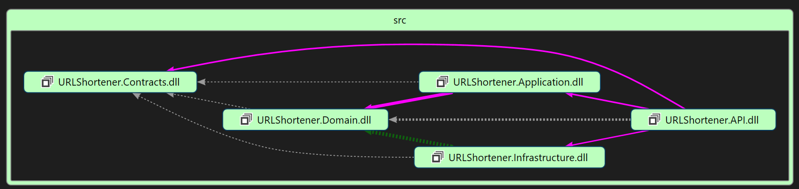
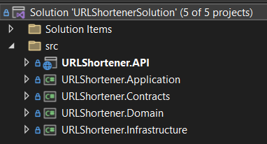

# URL Shortener
URL Shortener Project Built with .NET 7, MediatR, SQL Server and Memory Cache

:globe_with_meridians: [Demo](https://api.urlshortener.demo.eslamisepehr.com/)

# Endpoints

# Technologies
- [`.NET 7`](https://dotnet.microsoft.com/downloa) - .NET 7, including ASP.NET and ASP.NET Core
- [`Microsoft SQL Server EF Core Database Provider`](https://learn.microsoft.com/en-us/ef/core/providers/sql-server/?tabs=dotnet-core-cli)
- [`FluentValidation`](https://github.com/FluentValidation/FluentValidation) - Popular .NET validation library for building strongly-typed validation rules
- [`Scrutor`](https://github.com/khellang/Scrutor) - Assembly scanning and decoration extensions for Microsoft.Extensions.DependencyInjection
- [`ErrorOr`](https://github.com/amantinband/error-or) - A simple, fluent discriminated union of an error or a result
- [`MediatR`](https://github.com/jbogard/MediatR) - Simple, unambitious mediator implementation in .NET
- [`Swashbuckle`](https://github.com/domaindrivendev/Swashbuckle.AspNetCore) - Swagger tools for documenting API's built on ASP.NET

# Prerequisites
- Visual Studio 2022, Rider or VS Code
- .NET 7 SDK
 
# Run

- Set the Connection String on the `appsettings.json`.

- Open the `cmd` and run these commands:

    `cd src`

    `dotnet run --project URLShortener.API\URLShortener.API.`

# Application Architecture

# High-Level Structure

